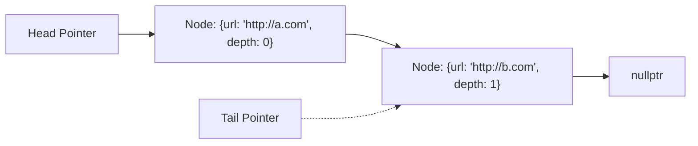
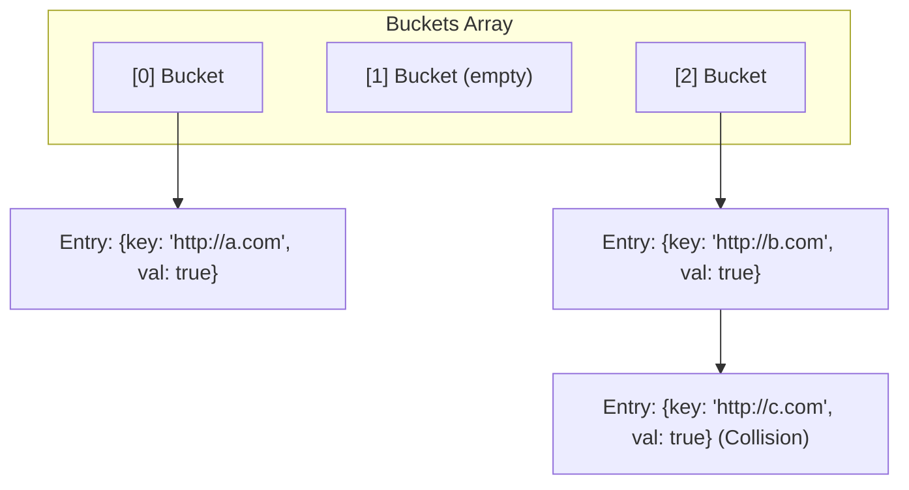
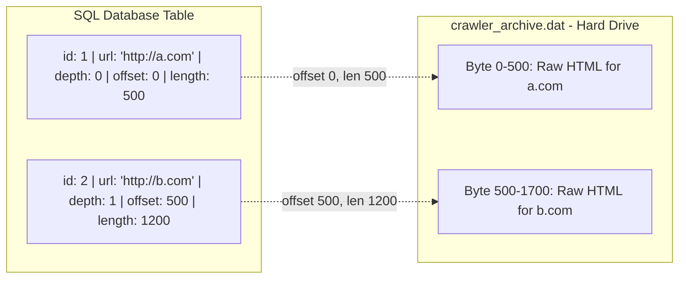

# Phase 0 — Design Proposal: Web Crawler

> **What is it?** A single-machine Web Crawler that fetches HTML pages, extracts outbound links, filters out duplicates, and stores the crawled pages for a future Indexer to consume.

---

## Section 1 — Public API

### 1. URL Frontier
Manages the list of URLs waiting to be crawled in a First-In, First-Out (FIFO) queue.

| Function | Signature | Description |
|---|---|---|
| `push` | `void push(std::string url, int depth)` | Adds a URL and its current depth to the back of the queue |
| `pop` | `FrontierEntry pop()` | Removes and returns the next URL-depth pair from the front |
| `isEmpty` | `bool isEmpty() const` | Returns `true` if there are no URLs left to crawl |
| `size` | `int size() const` | Returns the total number of elements in the frontier |

### 2. Seen URL Store
Tracks already visited URLs to prevent duplicate fetching and infinite loops.

| Function | Signature | Description |
|---|---|---|
| `markSeen` | `void markSeen(std::string url)` | Records a URL as visited in the internal hash map |
| `isSeen` | `bool isSeen(std::string url) const` | Returns `true` if the URL has been visited |
| `size` | `int size() const` | Returns the total number of unique visited URLs |

### 3. Page Storage
Stores successfully crawled pages. Exposes ID-based iteration for the Project 03 Indexer.

| Function | Signature | Description |
|---|---|---|
| `storePage` | `void storePage(std::string url, std::string html, int depth)` | Appends HTML to `.dat` file, gets offset, inserts row into SQL |
| `getPage` | `std::string getPage(std::string url)` | Queries SQL for offset/length, sequential read from `.dat` |
| `hasPage` | `bool hasPage(std::string url)` | Checks if a page is in SQL storage |
| `getURLByID`| `std::string getURLByID(int id)` | Queries SQL for URL by Primary Key `id` |
| `pageCount` | `int pageCount()` | Returns total row count from SQL |

### 4. Link Extractor & Downloader

| Component | Signature | Description |
|---|---|---|
| `LinkExtractor` | `DynamicArray<std::string> extractLinks(std::string html, std::string baseURL)` | Parses `<a href>` tags and normalizes relative links |
| `Downloader` | `virtual std::string fetchPage(std::string url) = 0` | Abstract interface for downloading HTML |

---

## Section 2 — Internal Representation

### Architectural Decisions & Justifications

1. **The URL Frontier (The Queue):** Implemented using the custom Project 01 `LinkedList<FrontierEntry>`. 
   - *Reasoning:* The frontier is a FIFO queue. If we used `DynamicArray`, removing from index 0 would force an O(N) memory shift for every remaining URL, bottlenecking the crawler. The `LinkedList` (with a tail pointer) provides O(1) insertions and removals. Storing `url` and `depth` in a single struct perfectly satisfies the data constraint.
2. **The Seen URL Store (Duplicate Detection):** Implemented using the custom Project 01 `HashMap<std::string, bool>`.
   - *Reasoning:* Duplicate detection happens on every single extracted link. We need instant O(1) lookups in RAM before touching the database to ensure the crawler does not get trapped in infinite loops.
3. **The Page Storage (CRITICAL CHANGE - The Database):** Implemented as a Hybrid SQL + Append-Only File architecture. (No in-memory arrays).
   - *The File:* Raw HTML is appended to a single, massive `crawler_archive.dat` file on the hard drive to prevent file-system inode exhaustion.
   - *The Database:* A SQL database table (`crawler_metadata`) stores structured data: `id` (Primary Key), `url`, `depth`, `byte_offset`, and `length`.
   - *The API:* `storePage()` appends to the file, gets the offset, and runs an SQL INSERT. `getPage()` queries the SQL database for the offset/length, then performs a fast sequential read from the `.dat` file.
4. **The Downloader (Network Transport):** Utilize CPR / libcurl wrapped in an abstract Downloader class.
   - *Reasoning:* It catches network errors internally and returns an empty string (`""`) on 404/500 errors. No headless browsers; we explicitly ignore SPA/JavaScript rendering to preserve high throughput.
5. **The Link Extractor (Parsing):** Implemented as an In-Place Cursor State Machine using `std::string::find()`.
   - *Reasoning:* We do not split strings or tokenize by space, as allocating thousands of tiny `std::string` objects per page causes catastrophic memory thrashing and CPU garbage collection overhead.
6. **Scope Management (Robots.txt):** Exclude robots.txt compliance from the Phase 0 single-machine MVP.
   - *Reasoning:* Excluded to maintain high network throughput without needing a centralized caching manager.
7. **Normalization Logic**: The Extractor normalizes all URLs.
   - *Reasoning:* Absolute URLs are kept, relative URLs are concatenated with the base URL, and garbage links (`mailto:`, `javascript:`) are instantly dropped to prevent network layer crashes.

### Structs & Nodes

```cpp
// Stored in the URL Frontier
struct FrontierEntry {
    std::string url;
    int depth;
};
```

### Memory Layout Diagram

*(Note: Please use this diagram as a reference to create your required hand-drawn submission).*

#### 1. URL Frontier (LinkedList)


#### 2. Seen URL Store (HashMap in RAM)


#### 3. Page Storage (Hybrid SQL + .dat Append-Only File)


---

## Section 3 — Failure Handling

| Failure Type | Handling Strategy |
|---|---|
| **Invalid/Garbage URLs** | The Extractor instantly drops garbage links (`mailto:`, `javascript:`, `#`) to prevent network layer crashes. |
| **Duplicate URLs** | Checked against `SeenURLStore` in O(1) time in RAM. Duplicate links are ignored and never pushed to the Frontier. |
| **Download Failures** | We utilize CPR/libcurl wrapped in an abstract Downloader class. The fetch function catches network errors internally and returns an empty string (`""`) on 404/500 errors. |
| **Malformed HTML** | The In-Place Cursor State Machine handles quote variations and unclosed tags without crashing. |
| **Empty Pages** | Pages returning `""` are stored in SQL with length `0` to prevent infinite re-crawling, but no links are extracted. |
| **JavaScript/SPAs** | We ignore SPA/JavaScript rendering entirely. |
| **Robots.txt** | Excluded from the MVP to maintain high network throughput. |

---

## Section 4 — Complexity Analysis

| Operation | Backing Structure | Best Case | Average Case | Worst Case |
|---|---|---|---|---|
| **Frontier Push** | `LinkedList::append` | O(1) | O(1) | O(1) |
| **Frontier Pop** | `LinkedList::removeFirst` | O(1) | O(1) | O(1) |
| **Seen URL Lookup**| `HashMap::contains` | O(1) | O(1) | O(N) (Hash Collisions) |
| **Seen URL Insert**| `HashMap::put` | O(1) | O(1) | O(N) (Array Rehash) |
| **Page Lookup** | SQL B-Tree Index | O(1) | O(log N) | O(log N) |
| **Page Insertion** | File Append + SQL Insert | O(1) | O(log N) | O(log N) (Index Update) |

---

## Section 5 — Future Compatibility

Our `PageStorage` API maps perfectly to Project 03 (Indexer) requirements. The Indexer will iterate sequentially through all stored pages using `pageCount()` and `getURLByID()`, totally decoupled from the SQL database and `.dat` file complexities.

```cpp
// Simulated Indexer logic from Project 03
for (int id = 0; id < storage.pageCount(); ++id) {
    // 1. Get the URL by sequential ID (SQL query)
    std::string url = storage.getURLByID(id);
    
    // 2. Fetch the raw HTML content (SQL Lookup -> Fast Sequential Disk Read)
    std::string html = storage.getPage(url); 
    
    // 3. Extract text and build the inverted index...
}
```
