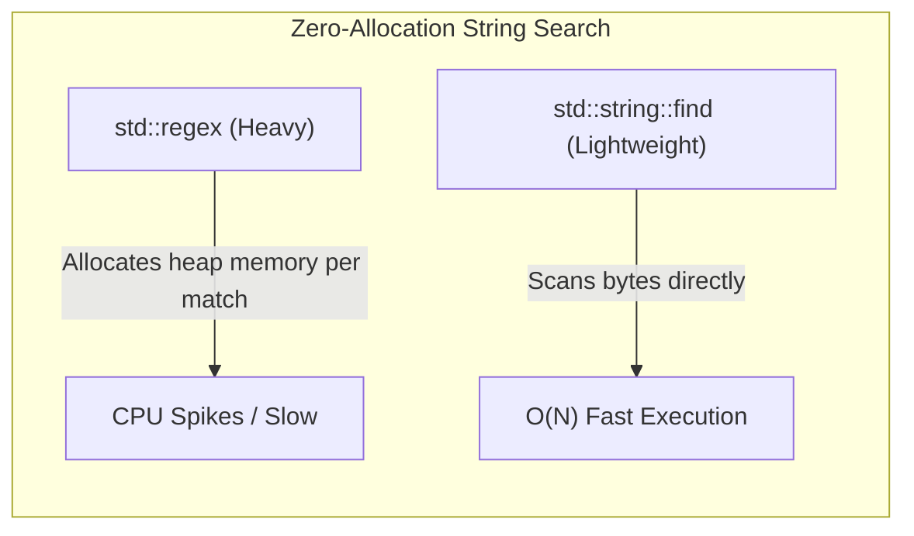

# Design Journal - July 10

## Entry July 10 (HTML Parsing)

**Section 1 — Specific Bug:**
When designing the HTML Parser for Step 5, we anticipated a massive CPU bottleneck. A crawler downloads thousands of massive 2MB+ raw HTML strings. Parsing these continuously to extract URLs using C++ standard regex would stall the crawler due to intense heap allocations and state-machine overhead inherent in regex engines.

**Section 2 — Failed Attempt:**
Considered using `<regex>` to match `<a href="([^"]*)">`. This approach creates temporary `std::smatch` objects for every single link found and forces the CPU to evaluate complex state machines for every character, resulting in catastrophic slow-downs.

**Section 3 — Memory Diagram:**

**Section 4 — Code Reference:**
Commit: "Implement fast HTML parser to extract hyperlinks"
File: `src/HTMLParser.cpp` (Lines 6-50)

**Section 5 — Learning Reflection:**
I learned that for simple, highly predictable markup extraction (like finding `<a href="`), manual byte-scanning using `std::string::find` avoids heap allocations entirely. Systems programmers must often bypass standard regex engines in favor of manual string searches to guarantee maximum throughput in high-performance applications.
