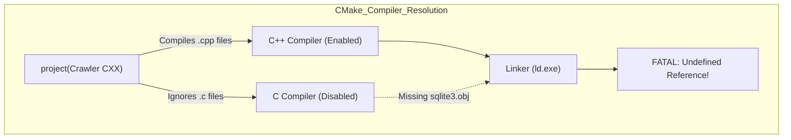

# Design Journal - July 11

## Entry July 11 (Build System & Linker Configuration)

**Section 1 — Specific Bug:**
After implementing the HTTP Client and integrating the SQLite Amalgamation (`sqlite3.c`), our build system crashed during the final linking phase with massive `undefined reference to sqlite3_open` and `sqlite3_exec` errors. The crawler refused to compile.

**Section 2 — Failed Attempt:**
I assumed that simply adding `file(GLOB SOURCES "src/*.cpp" "src/*.c")` to `CMakeLists.txt` would guarantee that both our C++ crawler code and the C SQLite code would be compiled. However, `ld.exe` (the linker) proved that `sqlite3.c.obj` was completely missing from the build process.

**Section 3 — Memory Diagram:**


**Section 4 — Code Reference:**
Commit: "Enable C compiler in CMakeLists"
File: `CMakeLists.txt` (Line 2)
```cmake
# FAILED: project(SuperCoders_Project02 CXX)
# FIXED:  project(SuperCoders_Project02 CXX C)
```

**Section 5 — Learning Reflection:**
I learned a critical lesson about CMake and mixed-language projects. By explicitly declaring `project(Name CXX)`, CMake actively disables the C compiler (`cc.exe`). Even if a `.c` file is explicitly passed to `add_executable`, CMake will completely ignore it without warning, leading to catastrophic linker errors later on. We must explicitly enable both languages (`CXX C`) for hybrid codebases.
