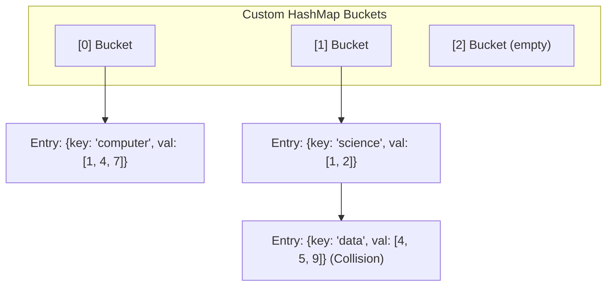

# Phase 0 — Design Proposal: Search Engine Indexer

> **What is it?** A single-machine Search Engine Indexer that reads raw HTML pages from the Crawler's Page Storage, extracts visible text, tokenizes it, and builds an Inverted Index in RAM to allow for fast keyword searches.

---

## Section 1 — Public API

### 1. Document Reader & Extractor
Reads HTML from storage and strips out all tags, leaving only clean, searchable text.

| Function | Signature | Description |
|---|---|---|
| `extractText` | `std::string extractText(std::string html)` | Parses HTML and removes all tags (e.g., `<script>`, `<div>`), returning plain text. |

### 2. Tokenizer
Splits the plain text into individual tokens and normalizes them (lowercasing, punctuation removal).

| Function | Signature | Description |
|---|---|---|
| `tokenize` | `DynamicArray<std::string> tokenize(std::string text)` | Splits text into words, converts to lowercase, removes punctuation. |
| `removeStopWords` | `void removeStopWords(DynamicArray<std::string>& tokens)` | Removes common stop words (e.g., "the", "and") to save memory and improve relevance. |

### 3. Inverted Index
Maps each unique word to the Document IDs where it appears.

| Function | Signature | Description |
|---|---|---|
| `addDocument` | `void addDocument(int docID, DynamicArray<std::string>& tokens)` | Updates the index mapping words to the given docID. |
| `search` | `DynamicArray<int> search(std::string query) const` | Returns a list of Document IDs that match the query keyword. |
| `size` | `int size() const` | Returns the total number of unique words in the index. |

---

## Section 2 — Internal Representation

### Architectural Decisions & Justifications

1. **The Inverted Index Structure:** Implemented using the custom Project 01 `HashMap<std::string, DynamicArray<int>>`.
   - *Reasoning:* We need to map each string token to a dynamically sized array of Document IDs. This provides O(1) average lookup time for any keyword. To maintain consistency across the codebase, we will exclusively rely on our custom STL-like data structures.
2. **Storage Strategy (RAM-First):**
   - *Reasoning:* The inverted index will be built entirely in memory during Phase 1. Building the inverted index requires constant updating and appending of document IDs to thousands of different words. Disk I/O during this phase would severely bottleneck the system. Once the in-memory index is stable and fast, Phase 2 will introduce persistence.
3. **Text Processing Constraints:**
   - *Reasoning:* Tokenization will be strictly exact-match with basic lowercasing and punctuation stripping. Stemming is excluded from the MVP to reduce complexity and ensure high throughput. Stop words will be filtered using a static hash set for O(1) lookups.
4. **HTML Parsing for Text Extraction:**
   - *Reasoning:* We will iterate character-by-character to skip anything between `<` and `>` (and explicitly ignore `<script>` and `<style>` blocks entirely). This follows the same highly-performant, zero-allocation state-machine approach we used for the Link Extractor.

### Structs & Nodes

```cpp
// Stored inside the custom HashMap
struct IndexEntry {
    std::string token;
    DynamicArray<int> documentIDs;
};
```

### Memory Layout Diagram

*(Note: Please use this diagram as a reference to create your required hand-drawn submission).*

#### 1. Inverted Index (RAM-First Strategy)


---

## Section 3 — Failure Handling

| Failure Type | Handling Strategy |
|---|---|
| **Malformed HTML** | The text extractor state machine safely ignores unclosed `<` brackets and missing closing tags by terminating at EOF. |
| **Out of Memory (OOM)** | Since this is built in RAM first, processing millions of pages will exhaust memory. The scope is limited to thousands of pages for the MVP. |
| **Punctuation Edge Cases** | Hyphenated words (e.g., "state-of-the-art") will be split into individual words to ensure they are searchable independently. |

---

## Section 4 — Complexity Analysis

| Operation | Backing Structure | Best Case | Average Case | Worst Case |
|---|---|---|---|---|
| **HTML Extraction** | In-Place Cursor State Machine | O(N) | O(N) | O(N) |
| **Tokenization** | Sequential string parsing | O(N) | O(N) | O(N) |
| **Index Add Word** | `HashMap::put` + `DynamicArray::append` | O(1) | O(1) | O(K) (Hash Collisions) |
| **Query Lookup** | `HashMap::get` | O(1) | O(1) | O(K) (Hash Collisions) |

---

## Section 5 — Future Compatibility

Our RAM-First `InvertedIndex` API maps perfectly to future persistence requirements. Once the in-memory system is validated, we can implement a `saveToDisk()` method to write the final HashMap state into a binary format or SQLite table, completely decoupled from the indexing logic.
